# Mini SOC Lab – Brute-Force Detection & Incident Response

A hands-on Security Operations Center project demonstrating real-time brute-force attack detection using Splunk SIEM, Windows Event Logs, and professional incident response workflow.

---

## 📋 Table of Contents

- [Overview](#overview)
- [Project Objectives](#project-objectives)
- [Lab Architecture](#lab-architecture)
- [Technologies Used](#technologies-used)
- [Implementation Details](#implementation-details)
- [Key Findings](#key-findings)
- [MITRE ATT&CK Mapping](#mitre-attck-mapping)
- [Screenshots](#screenshots)
- [Deliverables](#deliverables)
- [Skills Demonstrated](#skills-demonstrated)
- [Author](#author)

---

## 🎯 Overview

This project simulates a real-world Security Operations Center environment where a brute-force authentication attack is detected, investigated, and documented using industry-standard tools and methodologies. The lab demonstrates practical competencies in SIEM deployment, log analysis, threat detection, alert configuration, and incident response documentation.

**Incident Summary:**
- **Attack Type:** Brute-Force Authentication Attack
- **Target Accounts:** Dr.Nee (admin), testuser
- **Detection Time:** Real-time (under 60 seconds)
- **Failed Attempts:** 4 per account (8 total)
- **Outcome:** Successfully detected and documented; no unauthorized access achieved

---

## 🎓 Project Objectives

This project was designed to develop and demonstrate the following capabilities:

1. Deploy and configure Splunk Enterprise SIEM platform on Linux infrastructure for centralized security monitoring
2. Implement log forwarding architecture using Splunk Universal Forwarder to collect Windows Security Event Logs
3. Develop detection logic using Search Processing Language to identify suspicious authentication patterns
4. Configure automated real-time alerting based on threshold-based detection rules
5. Execute incident response workflow including identification, analysis, documentation, and remediation recommendations
6. Map detected threats to the MITRE ATT&CK framework for standardized threat classification
7. Produce professional incident documentation suitable for SOC operational use

---

## 🏗️ Lab Architecture

The lab environment consists of two primary components working in a bridged network configuration to simulate enterprise SOC operations:

**Infrastructure Components:**

**SIEM Platform (Kali Linux VM)**
- Role: Security monitoring and analysis
- IP Address: 10.232.194.7
- Splunk Enterprise 10.2.0
- Web Interface Port: 8000
- Receiving Port: 9997

**Target System (Windows 10 Host)**
- Role: Log source and attack target
- IP Address: 10.232.194.141
- Splunk Universal Forwarder 10.2.0
- Windows Security Event Log forwarding enabled

**Data Flow:**

The architecture implements a standard SIEM log collection pipeline. Windows Security events are captured locally on the Windows 10 system, particularly focusing on Event ID 4625 (failed logon attempts). The Splunk Universal Forwarder running on the Windows host collects these events and forwards them over TCP port 9997 to the Splunk Enterprise instance on the Kali Linux system. The SIEM platform then indexes these events, enabling real-time search, correlation, and alerting capabilities. When the detection query identifies failed login patterns exceeding the configured threshold, automated alerts are triggered and logged for SOC analyst review.

---

## 🛠️ Technologies Used

**Security Information and Event Management:**
- Splunk Enterprise 10.2.0 for log aggregation, correlation, and analysis
- Splunk Universal Forwarder 10.2.0 for lightweight log collection and forwarding
- Search Processing Language for query development and threat detection

**Operating Systems and Virtualization:**
- Kali Linux (SIEM hosting platform)
- Windows 10 Build 19045 (target system and log source)
- Oracle VirtualBox for virtualization infrastructure

**Security Frameworks and Standards:**
- MITRE ATT&CK Framework for threat classification
- Windows Event Log architecture for security monitoring
- Standard SOC incident response methodology

---

## 📖 Implementation Details

### Phase 1: SIEM Infrastructure Deployment

The Splunk Enterprise platform was deployed on Kali Linux following security best practices. The installation process included verifying system prerequisites, configuring the receiving port for log ingestion, and establishing administrative access controls. The SIEM was configured to listen on port 9997 for incoming log streams from remote forwarders.

### Phase 2: Log Collection Configuration

Splunk Universal Forwarder was installed on the Windows 10 target system and configured to forward Windows Security Event Logs to the central SIEM. The forwarder was pointed to the Kali SIEM instance at IP address 10.232.194.7 on port 9997. Input configuration was established to monitor the Windows Security log channel, with events being indexed in the main index for analysis.

### Phase 3: Windows Auditing Enablement

Windows audit policies were configured to ensure comprehensive logging of authentication events. The Logon audit subcategory was enabled for both success and failure events using the auditpol command-line utility. This configuration ensures that all authentication attempts, whether successful or failed, are captured in the Security event log.

### Phase 4: Attack Simulation

A test user account was created on the Windows system to serve as the target for simulated brute-force activity. Multiple failed authentication attempts were generated using the runas command with incorrect credentials. This produced authentic Event ID 4625 (failed logon) events in the Windows Security log, which were then forwarded to Splunk for detection and analysis.

### Phase 5: Detection Logic Development

A detection query was developed using Splunk's Search Processing Language to identify potential brute-force attacks. The query searches for Event ID 4625, aggregates failed login attempts by account name, filters for accounts with three or more failures (indicating potential attack activity), and sorts results to prioritize accounts with the highest failure counts. This threshold-based approach balances detection sensitivity with false positive reduction.

### Phase 6: Alert Configuration

A real-time alert was configured in Splunk to provide automated detection of brute-force activity. The alert executes continuously, triggering when any user account accumulates three or more failed login attempts. The per-result trigger configuration ensures that each affected account generates an individual alert. The alert action logs the event with dynamic field substitution, recording the account name and failure count for SOC analyst review.

---

## 📊 Key Findings

### Detection Results

The SIEM successfully identified brute-force authentication attempts against two user accounts within the monitored environment. The detection query revealed the following:

**Account: Dr.Nee**
- Failed Login Attempts: 4
- Status: Above threshold (≥3)
- Classification: Potential brute-force activity detected

**Account: testuser**
- Failed Login Attempts: 4  
- Status: Above threshold (≥3)
- Classification: Potential brute-force activity detected

### Technical Analysis

All detected events were classified as Event ID 4625 (An account failed to log on), indicating failed authentication attempts. The failure reason in all cases was "Unknown user name or bad password," consistent with credential guessing behavior. The logon type was Interactive (Type 2), indicating attempts to log on directly at the console. The source computer was identified as NATIONALIST in all events.

### Security Impact Assessment

The attack attempts were unsuccessful. No unauthorized access was achieved, and all targeted accounts remained secure throughout the incident. The detection mechanisms functioned as designed, identifying the suspicious activity in real-time and generating appropriate alerts for investigation.

---

## 🎯 MITRE ATT&CK Mapping

The detected attack activity has been mapped to the MITRE ATT&CK framework for standardized threat classification and communication:

**Tactic:** Credential Access (TA0006)  
Adversaries attempt to obtain valid credentials to gain access to systems and networks.

**Technique:** Brute Force (T1110)  
Adversaries attempt to gain access to accounts by systematically guessing passwords through repeated authentication attempts.

**Sub-technique:** Password Guessing (T1110.001)  
Without prior knowledge of legitimate credentials, adversaries guess passwords to gain access to accounts.

**Detection Method:** Monitor authentication logs for multiple failed login attempts, especially those occurring in rapid succession or targeting multiple accounts. Implement threshold-based alerting for accounts exceeding normal failed authentication baselines.

Reference: https://attack.mitre.org/techniques/T1110/

---

## 📸 Screenshots

Visual documentation of the complete SOC lab implementation and detection workflow.

### Lab Infrastructure Setup

#### Splunk Enterprise Startup
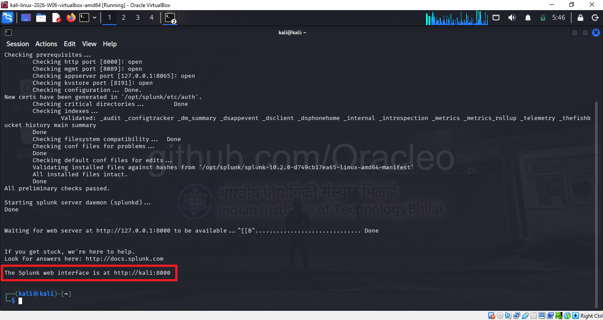

The Splunk Enterprise service successfully starts on the Kali Linux system, completing all prerequisite checks including port availability verification (8000, 8089, 8065, 8191), configuration validation, and index integrity checks. The startup sequence confirms that new certificates have been generated and all installed files are intact. The web interface becomes available at http://kali:8000.

#### Splunk Login Interface
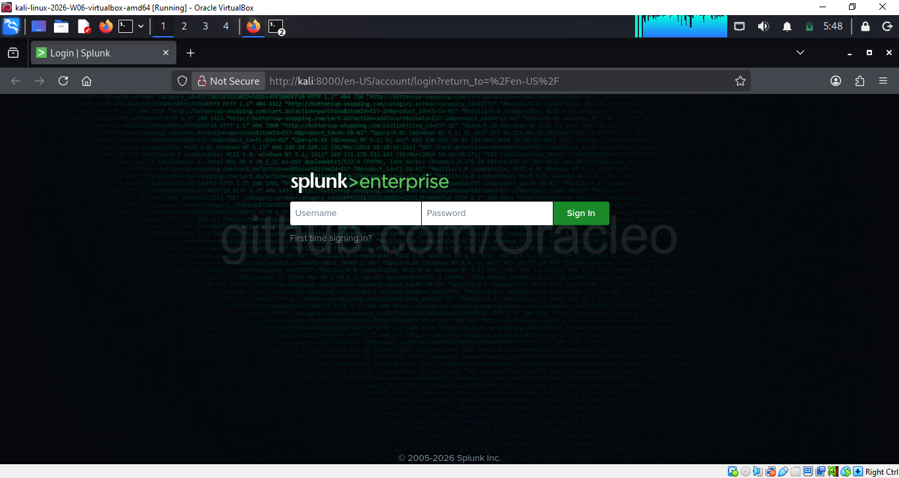

The Splunk Enterprise web interface login page, accessible via the Kali Linux browser at http://kali:8000. This interface provides secure access to the SIEM platform using administrator credentials established during initial configuration.

#### Splunk Home Dashboard
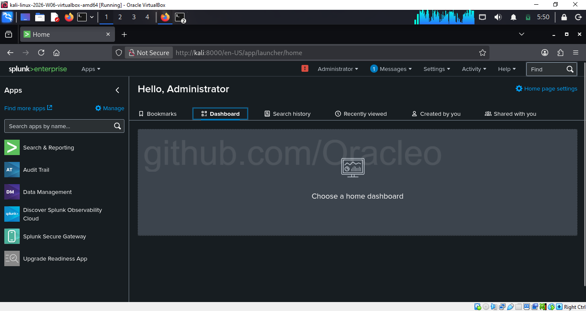

The Splunk home dashboard displays after successful authentication, showing the main navigation interface including Search & Reporting, Analytics, Datasets, Reports, Alerts, Dashboards, and Modules. The left sidebar provides access to installed applications including Audit Trail, Data Management, and other Splunk components.

#### Network Configuration
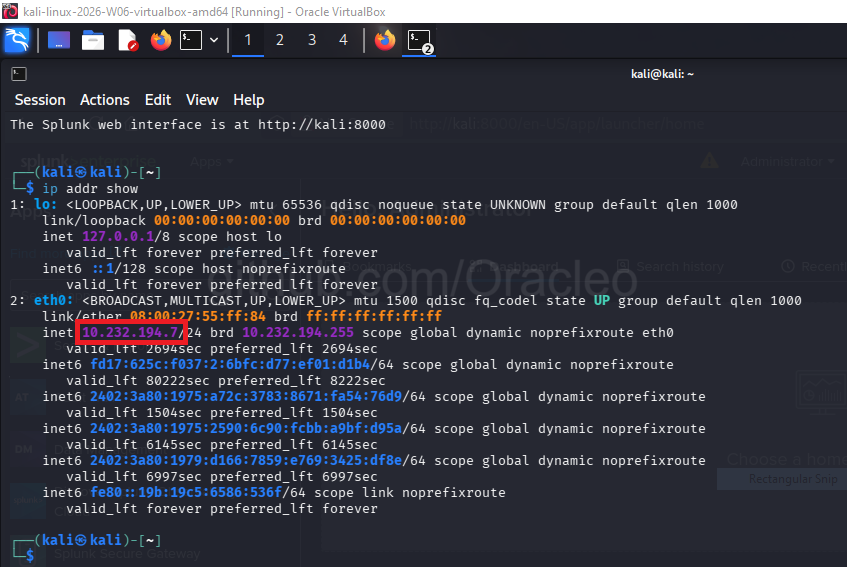

The Kali Linux network configuration showing the eth0 interface with IP address 10.232.194.7/24 in bridged adapter mode. This network configuration enables direct communication between the SIEM platform and the Windows target system on the same subnet.

#### Connectivity Verification
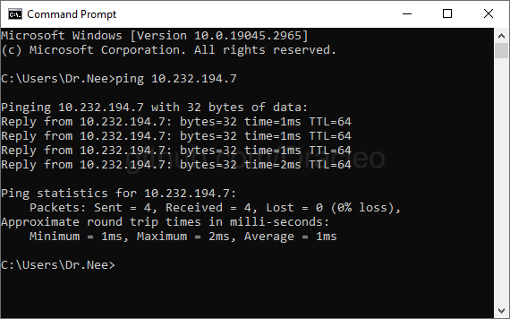

Successful ICMP connectivity test from the Windows 10 host to the Kali Linux SIEM at IP address 10.232.194.7. The ping results show four successful replies with minimal latency (1-2ms) and zero packet loss, confirming proper network configuration for log forwarding.

---

### Log Collection Configuration

#### Data Input Configuration
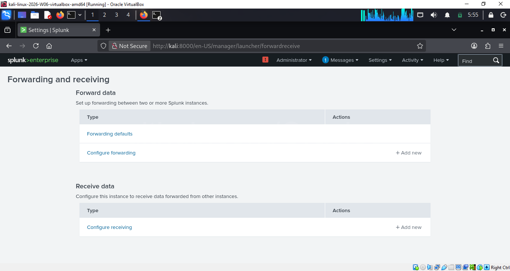

The Splunk Settings page displaying available data input types including Files & Directories, HTTP Event Collector, TCP, UDP, and Scripts. The Forwarding and receiving option is visible, providing access to configure log reception from remote Universal Forwarders.

#### Receiving Port Configuration
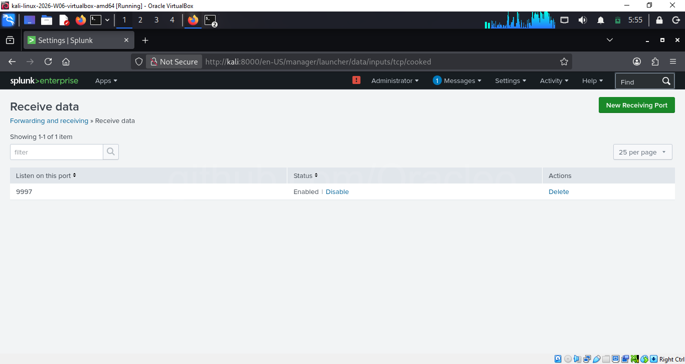

The configured receiving port shows port 9997 in enabled status, ready to accept incoming log streams from Splunk Universal Forwarders. This is the standard port for Splunk-to-Splunk forwarding in enterprise deployments.

#### Log Ingestion Verification
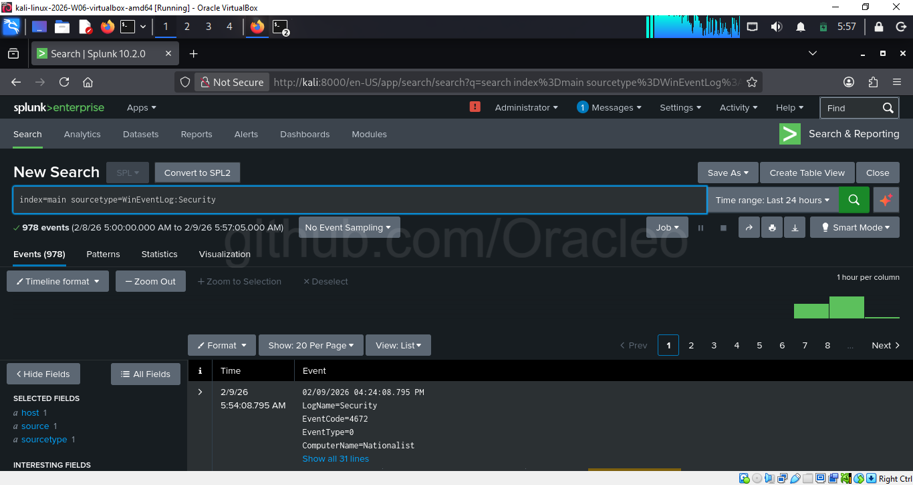

Search results confirming successful ingestion of Windows Security Event Logs into Splunk. The query "index=main sourcetype=WinEventLog:Security" returns 978 events collected from the Windows system, demonstrating that the log forwarding pipeline is operational and events are being indexed in real-time.

---

### Attack Simulation

#### Test Account Creation
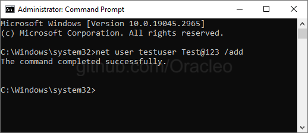

Windows Command Prompt showing successful creation of the test user account using the command "net user testuser Test@123 /add". This account serves as one of the targets for simulated brute-force authentication attempts.

#### Failed Authentication Attempts
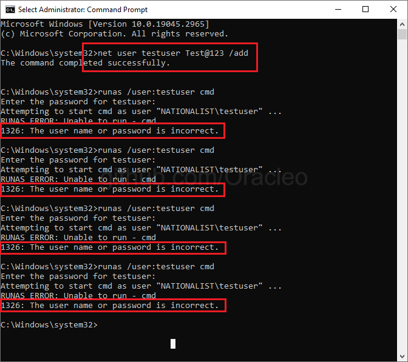

Windows Command Prompt displaying multiple failed authentication attempts using the runas command. Each attempt with an incorrect password generates error 1326 ("The user name or password is incorrect"), creating Event ID 4625 entries in the Windows Security log that are forwarded to Splunk for detection.

---

### Detection and Analysis

#### Failed Logon Event Search
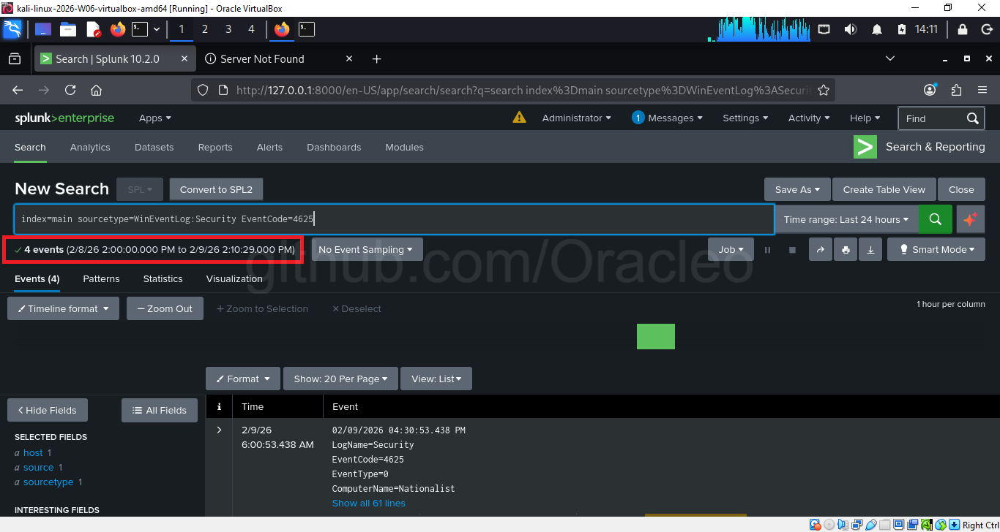

Splunk search results filtering for Event ID 4625 (failed logon attempts). The search returns 4 events within the specified timeframe, with the timeline visualization showing a concentrated spike of activity indicating the simulated attack period.

#### Event Detail Analysis
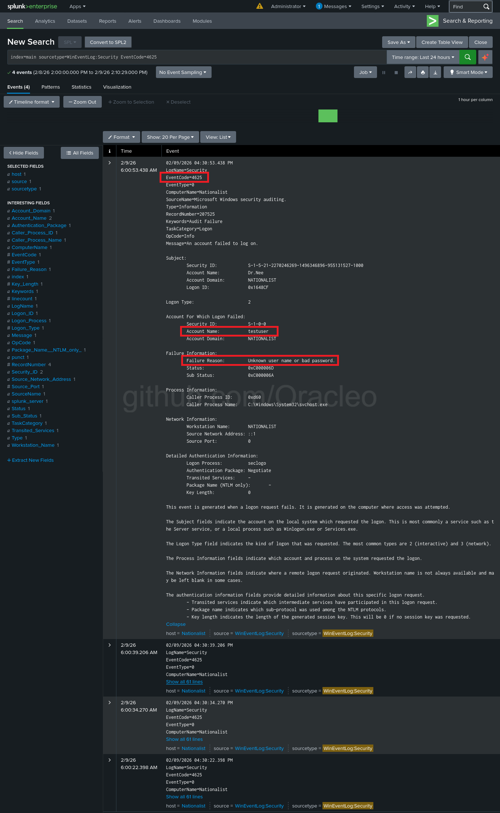

Detailed view of a single Event ID 4625 event showing all forensically relevant fields. Key details include Account Name (testuser), Failure Reason ("Unknown user name or bad password"), Logon Type (2 - Interactive), Computer Name (NATIONALIST), and authentication failure specifics. The expanded view provides complete event context for incident investigation.

#### Brute-Force Detection Query Results
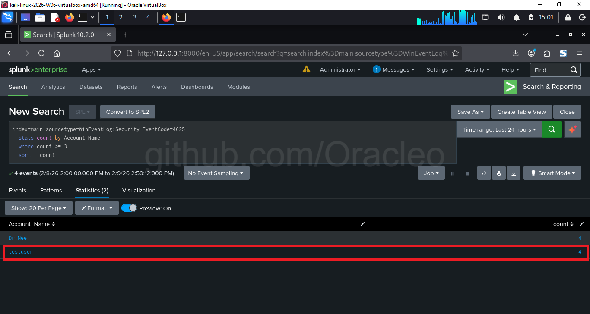

Results of the brute-force detection query using the Statistics tab view. The query aggregates failed login attempts by account name and filters for accounts with three or more failures. Two accounts are identified: Dr.Nee with 4 failed attempts and testuser with 4 failed attempts, both exceeding the detection threshold and indicating potential brute-force activity.

#### Visual Detection Analysis
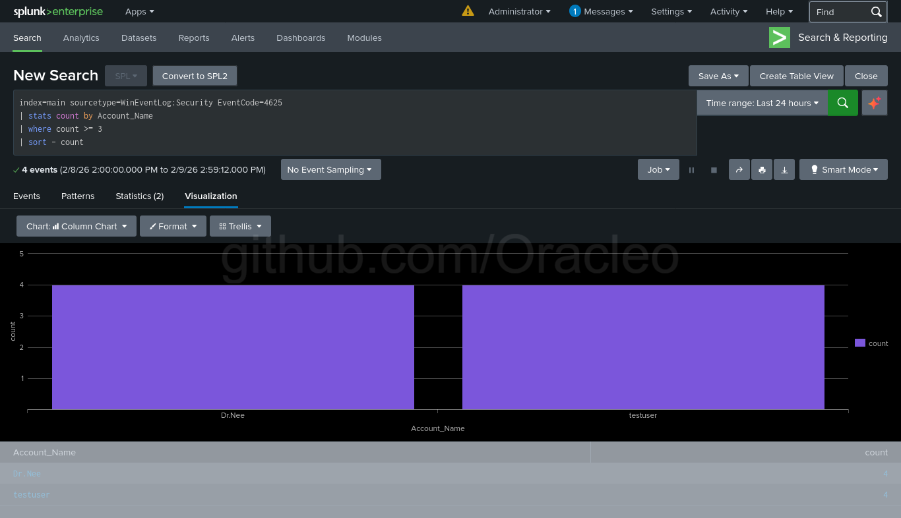

Column chart visualization of the detection query results showing failed login attempt counts by account. The visualization clearly displays both Dr.Nee and testuser with equal failure counts of 4, providing immediate visual confirmation of the brute-force pattern affecting multiple accounts.

---

### Alert Configuration

#### Alert Creation Dialog
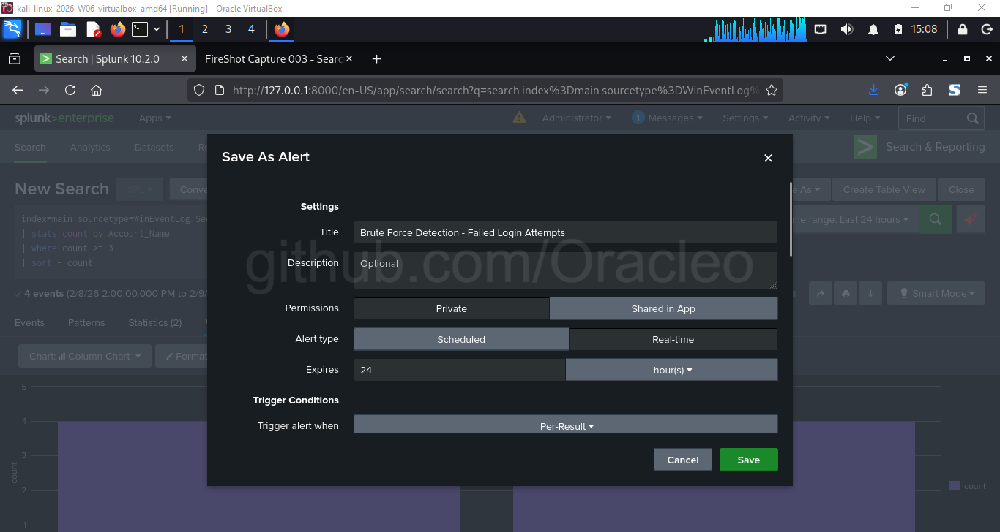

The "Save As Alert" configuration interface showing the initial alert settings. The alert is titled "Brute Force Detection - Failed Login Attempts" with Real-time alert type selected for continuous monitoring. The Trigger Condition is set to Per-Result, meaning the alert will fire once for each user account detected with excessive failed login attempts.

#### Alert Action Configuration
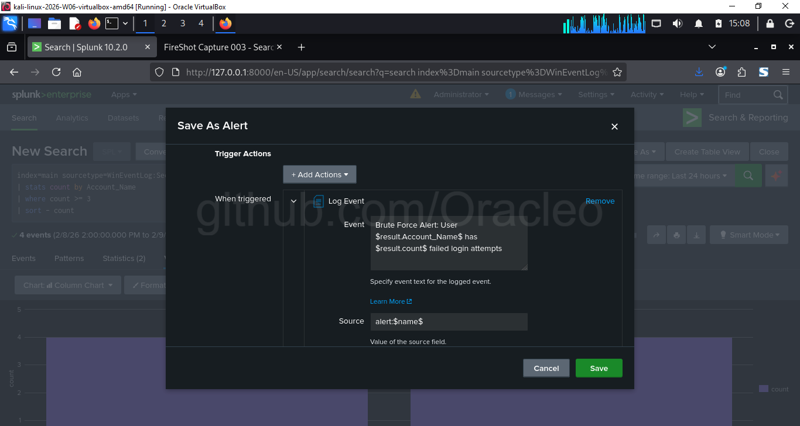

The Trigger Actions section of the alert configuration showing the Log Event action. The event text is configured with dynamic field substitution: "Brute Force Alert: User $result.Account_Name$ has $result.count$ failed login attempts". This creates informative log entries that include the specific account name and failure count for each triggered alert.

#### Alert Save Confirmation
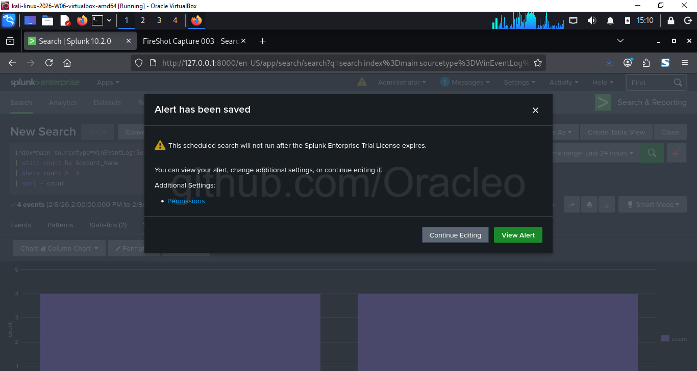

Confirmation dialog indicating successful alert creation. The system displays a warning that the scheduled search will not run after the Splunk Enterprise Trial License expires, along with options to view the alert or continue editing its configuration.

#### Alert Status Dashboard
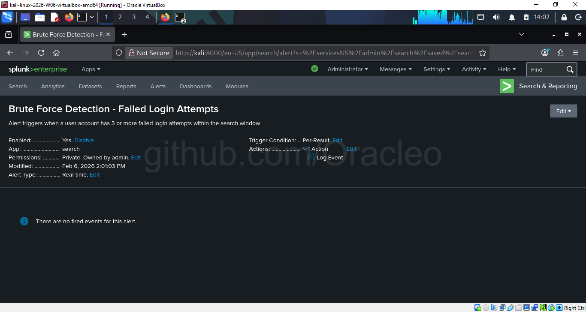

The alert details page showing the configured brute-force detection alert in enabled status. Key configuration details are displayed including: Enabled (Yes), App (search), Permissions (Private, owned by admin), Modified date (Feb 6, 2026 2:01:03 PM), Alert Type (Real-time), Trigger Condition (Per-Result), and Actions (1 Action - Log Event). The status "There are no fired events for this alert" is expected as the alert monitors for new events going forward.

---

## 📦 Deliverables

This repository provides comprehensive documentation and evidence of the SOC lab implementation:

**Documentation:**
- README.md: Complete project overview, methodology, and findings
- SOC_Brute_Force_Incident_Report.docx: Professional incident report following SOC documentation standards

**Technical Artifacts:**
- detection_query.txt: Splunk SPL queries with detailed explanations
- setup_guide.md: Step-by-step implementation instructions

**Visual Evidence:**
- screenshots/: Complete collection of 18 screenshots documenting the entire workflow from infrastructure setup through alert configuration

**Configuration Examples:**
- Splunk receiving port configuration (9997)
- Universal Forwarder setup and forwarding configuration
- Windows audit policy configuration
- Real-time alert configuration with automated actions

---

## 💡 Skills Demonstrated

This project demonstrates practical competencies required for Security Operations Center analyst roles:

**SIEM Operations:**
- Splunk Enterprise deployment and configuration on Linux infrastructure
- Log source configuration and centralized log collection architecture
- Search Processing Language query development for threat detection
- Dashboard and visualization creation for security monitoring
- Alert configuration with automated response actions

**Security Monitoring:**
- Windows Security Event Log analysis and correlation
- Authentication failure pattern recognition
- Threshold-based anomaly detection
- Real-time threat identification and alerting

**Incident Response:**
- Structured incident investigation methodology
- Evidence collection and preservation
- Impact assessment and severity classification
- Professional incident documentation and reporting
- Remediation recommendation development

**Technical Proficiency:**
- Linux system administration (Kali)
- Windows security configuration and audit policy management
- Network configuration and troubleshooting (bridged networking)
- Log forwarding architecture implementation
- Security framework alignment (MITRE ATT&CK)

**Professional Communication:**
- Technical documentation writing
- Security findings presentation
- Stakeholder-appropriate reporting
- Evidence-based analysis and recommendations

---

## 📝 Future Enhancements

Potential expansions to this project include:

**Enhanced Detection Capabilities:**
- Implement correlation rules for distributed brute-force attacks across multiple source IPs
- Develop temporal analysis to identify slow brute-force attempts
- Create detection logic for successful authentication following failed attempts (potential compromise indicator)
- Build automated enrichment using threat intelligence feeds

**Automated Response:**
- Implement account lockout automation via scripted alert actions
- Configure email notifications to security team on alert trigger
- Integrate with SOAR platform for orchestrated response workflows
- Develop automated incident ticket creation in ticketing system

**Visualization and Reporting:**
- Create executive dashboard with key performance indicators
- Build geolocation analysis for authentication attempts
- Develop trending analysis for authentication failures over time
- Implement automated daily security summary reports

**Expanded Monitoring:**
- Add Linux SSH brute-force detection from auth.log
- Implement privilege escalation detection
- Monitor for lateral movement indicators
- Develop file integrity monitoring alerts

---

## 👤 Author

**Niladri Biswas**  
M.Tech Information Security (Pursuing)  
West Bengal University of Technology (MAKAUT)

**Professional Links:**
- Email: dr.niladribiswas@gmail.com
- LinkedIn: [linkedin.com/in/dr-niladri-biswas](https://linkedin.com/in/dr-niladri-biswas)
- GitHub: [github.com/oracleo](https://github.com/oracleo)
- TryHackMe: [tryhackme.com/p/dr.nee](https://tryhackme.com/p/dr.nee)

**Certifications:**
- ISC2 Certified in Cybersecurity (CC)
- Cisco Ethical Hacker
- TryHackMe PreSecurity Pathway

---

## 📝 License

This project is created for educational and portfolio purposes. The methodologies and techniques demonstrated should only be used in authorized laboratory environments or with explicit permission on production systems.

---

## 🙏 Acknowledgments

- Splunk Community for comprehensive documentation and resources
- MITRE Corporation for the ATT&CK framework
- TryHackMe for SOC analyst training pathways
- Information security community for best practices and guidance

---

**Project Completion Date:** February 6, 2026

**Last Updated:** February 9, 2026

---

⭐ **If you found this project valuable, please consider starring the repository!**

---
